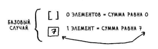
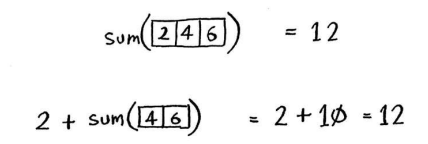
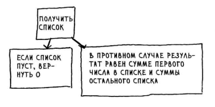
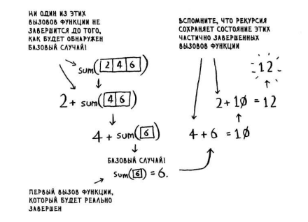
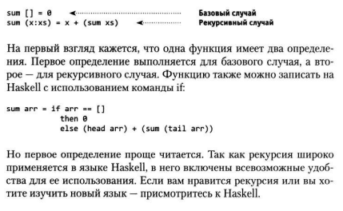

# Разделяй и властвуй

Решение задачи методом "Разделяй и властвуй" состоит из двух шагов:
1. Сначала определяется базовый случай. Это должен быть простейший случай из всех возможных.
2. Задача делится и сокращается до тех пор, пока не будет сведена к базовому случаю.

***Пример задачи 1:***

Поле (1680 м. на 640 м.) нужно равномерно разделить на одинаковые кдвадратные участки.
Сделать это можно с помощью [Алгоритма Евклида](https://github.com/gireassen/my_library/blob/main/lib/groc_alg/divide_and_conquer/evklid.py), найдя НОД равный 80 м. на 80 м.


Итак, для исходного надела земли самый большой размер участка будет 80 х 80 м.

***Пример задачи 2:***

Имеется массив чисел: [2,4,6]
Нужно просуммировать все числа и вернуть сумму.
Сделать это в цикле совсем не сложно:

```
def summ(arr):
    total = 0
    for x in arr:
        total += x
    return total
```

Вопрос в том, как сделать это с использованием рекурсивной функции?

**Шаг 1:** определить базовый случай.



**Шаг 2:** кадлый рекурсивный вызов должен приближаться к пустому массиву.



Во второй версии передается меньший массив.

Функция sum() может работать по следующей схеме:





***Совет:***
> Когда пишем рекурсивную функцию, в которой задействован массив, базовым случаем часто оказывается пустой массив или массив из одного элемента. Если вы не знаете, с чего начать, - начните с этого.

# Функциональное программирование

В языках функционального программирования, циклов нет, пожтому приходится применять рекурсию.
Если вы хорошо пониматете рекурсию, вам будет проще изучать функциональные языки.

